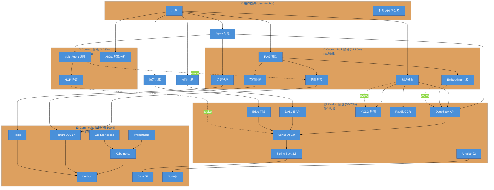

## Wardley Map

## 战略决策指引

| 演化阶段 | 组件示例 | 战略决策 | 投入建议 |
|---------|---------|----------|----------|
| **Genesis (0-25%)** | Multi-Agent, MCP-Protocol, AIOps | 差异化竞争 | 研发投入，探索创新 |
| **Custom Built (25-50%)** | RAG-Chat, Vision-Analysis, Embedding | 内部构建 | 积累能力，沉淀资产 |
| **Product (50-75%)** | DeepSeek-API, Spring-AI, Angular | 优化选择 | 评估供应商，避免锁定 |
| **Commodity (75-100%)** | Kubernetes, Docker, PostgreSQL | 标准化采购 | 成本优先，自动化 |

## 坐标系统说明

Wardley Map 使用 **OWM (OnlineWardleyMaps)** 坐标格式 `[visibility, evolution]`：

- **Visibility (Y轴)**: 0.0 = 基础设施, 1.0 = 用户可见
- **Evolution (X轴)**: 0.0 = Genesis, 1.0 = Commodity

## 关键洞察

1. **AIOps 面板**处于 Genesis 阶段，需要持续投入探索
2. **向量检索**正在从 Custom Built 向 Product 演进
3. **LLM 推理**高度依赖外部 API，需要考虑多 Provider 策略
4. **基础设施**已高度标准化，无需重复造轮子
